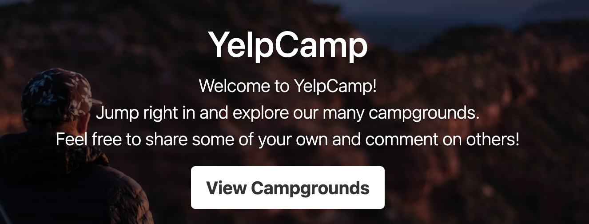
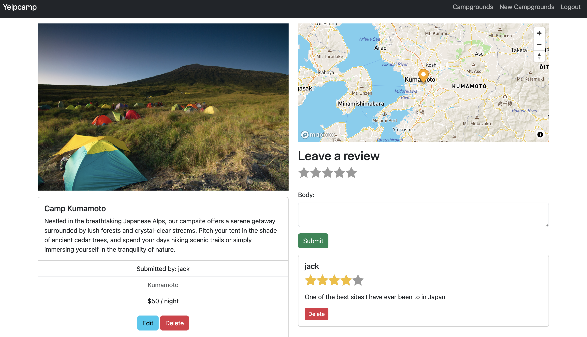

## YelpCamp 
A campsite review-sharing and discovery platform built using Express, Node, MongoDb, and Mongoose.

## Overview 
This app is my first full-stack project. It was built to consolidate the concepts I had learned from
my full-stack course. Topics include but are not limited to: 
This web app was made for two reasons:
1. NodeJS (NPM)
2. ExpressJS (Templating, RESTful APIs)
3. MongoDB (Cloud Databases, Database Association)
4. Mongoose (Schema Designs)
5. Authentication (local auth, Passport)
6. Cookies & Sessions
7. Authorization
8. Common Security Issues - SQL Injection, XSS, etc.
9. Image upload & Storage (Cloudinary)
10. Maps and Geocoding

## Features
1. A index page listing all existing campsites
2. A clustermap showing campsite distribution in any region 
2. Create new account, login, log out, register accounts
3. Upload and store images in the cloud when creating new campsites
5. Display all images in carousel for viewing    

## Installation
To run the project locally: 

1. Clone this project locally
2. Create .env file in the root directoryand add all necessary variables locally (api_keys, secrets, etc)
3. Replace all existing urls to local ones (database, port, etc) 
4. Run `npm install`to install dependencies
5. Run `node app.js`to start the server

## Dependencies
@mapbox/mapbox-gl-geocoder
@mapbox/mapbox-sdk
cloudinary
connect-flash
connect-mongo
dotenv
ejs
ejs-mate
express
express-mongo-sanitize
express-router
express-session
helmet
joi
mapbox-gl
method-override
mongoose
multer
multer-storage-cloudinary
passport
passport-local
passport-local-mongoose
sanitize-html

## Technologies
- Node.js, Express.js, MongoDB, Mongoose, Mapbox, Cloudinary

## Demo

 
## Improvements
Features ideas
- convert to TypeScript
- improve responsiveness
- standardize image display dimension 

